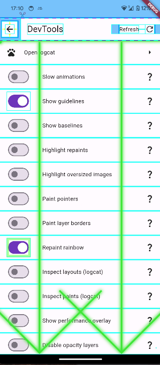

This is devtools package. Use flutter devtools on the go. Just install debug app version and enjoy all the helpful tools to inspect your app

## Features

All you could do with IDE of your choice- always with you:
- Slowing animations
- Highlight repaints
- Inspect oversized images
- Show guidelines
- Disable opacity layers
- Paint layer borders
- and more...



## Getting started

To use base functionalities just set up navigation to devtools screen
```
Navigator.of(context).push(MaterialPageRoute(
                        builder: (context) => const DevtoolsMenuScreen()));
```

To use MaterialApp tools add these lines to your MaterialApp constructor


```
showPerformanceOverlay: DebugOptions.performanceOverlay.object.debugValue,
```

```
checkerboardOffscreenLayers: DebugOptions.offscreenLayers.object.optionValue,
```

```
checkerboardRasterCacheImages:DebugOptions.rasterCacheImages.object.optionValue,
```

```
debugShowMaterialGrid: DebugOptions.materialGrid.object.optionValue,
```

```
showSemanticsDebugger: DebugOptions.semanticsDebugger.object.optionValue,
```


REMEMBER THAT DEBUG FEATURES CAN ONLY BE USED IN DEBUG MODE - RELEASE MODE FUNCTIONALITIES DIFFER


## Roadmap
- architecture overhaul (current file structure is still a mess)
- live logcat view (Android only)
- translations (?)
- network call hijacker - monitor all your app's network calls in one place
- more tools based on feedback

## Additional information

File issues on package's github page. Ideas too ;)
